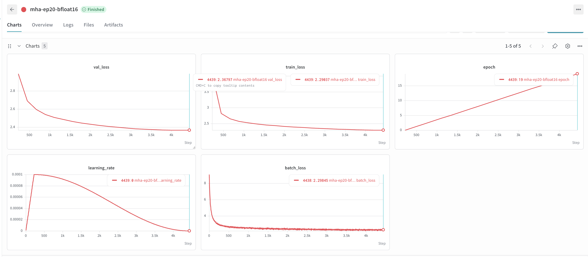
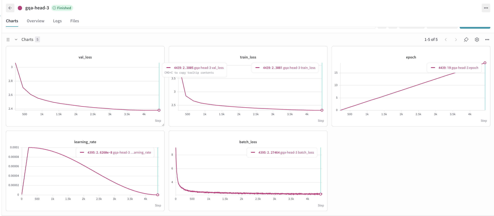
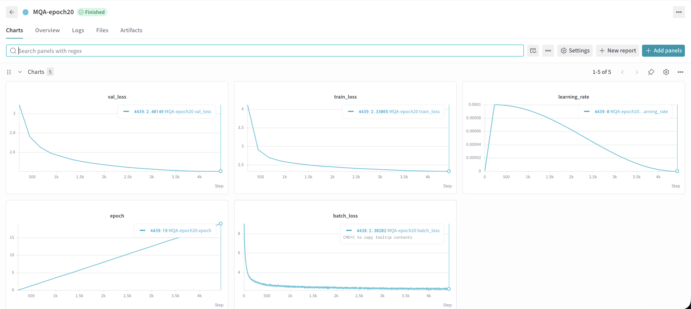
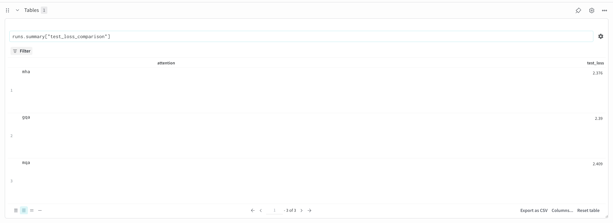
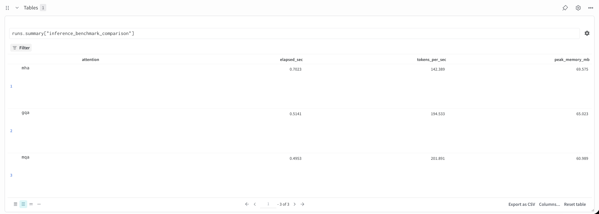

# Results

Comparison of MHA, GQA, and MQA attention on a small GPT-style model
trained from scratch on WikiText-103.

## Training runs (20 epochs each)

### MHA

### GQA

### MQA

## Test set evaluation

Final checkpoint (best val loss) for each model, evaluated on the held-out
test set.

| Attention | Test loss |
|---|---|
| MHA | 2.376 |
| GQA | 2.390 |
| MQA | 2.409 |

## Inference benchmark

100 tokens generated, batch size 1, single A40 GPU.

| Attention | Tokens/sec | Peak memory (MB) |
|---|---|---|
| MHA | 142.389 | 69.575 |
| GQA | 194.533 | 65.023 |
| MQA | 201.891 | 60.989 |

## Takeaway

MHA has the best loss but is the slowest to generate from. MQA is the
fastest and lightest but has the worst loss. GQA sits close to MQA on
speed while staying close to MHA on quality.